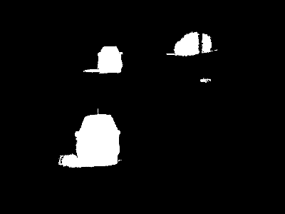
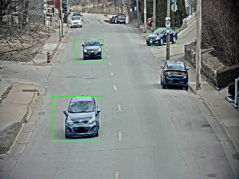

# mcv-c6-2025-team6

## Week 1 - Background estimation and Stauffer & Grimson

### Data
Add the AICity_data folder at the same level of the main.py script. The data should be organized as follows:

```
data
│
└───AICity_data
    |
    └───train
    |   └───S03
    |   |   └───c010
    |   |   |   └───vdo.avi
    └───ai_challenge_s03_c010-full_annotation.xml
```
### Install Dependencies
To install the required packages to run the program, execute the following command:

```bash
pip install -r requirements.txt
```

### Project Structure
This project contains the following main Python scripts:
- task1_and_2.py: This script contains the implementation for Task 1 and Task 2.
- utils.py: This file contains utility functions used by task1_and_2.py for Task 1 and Task 2.
- task3.py: This script contains the implementation for Task 3.
- optuna.py: This file is used by task3.py to handle hyperparameter optimization with Optuna.


### Usage
To run Task 1 (Non-Adaptive) and Task 2 (Adaptive), you need to set specific parameters depending on the method you want to use. Below is a guide on which parameters to modify and the best configurations for each approach.

Key Parameters:
- adaptive_segmentation = False (non-adaptive) / True (adaptive)
- alpha: Works similarly to non-adaptive mode but should be tuned based on background changes.
- rho: Learning rate for updating the background model. # Not used in non-adaptive mode
- eps: # Clustering distance threshold
- margin_overlap # Tolerance for overlapping bounding boxes
- min_area  # Minimum object size to consider

#### Task 1: Non-Adaptive Background Subtraction
In this mode, the background model remains static, meaning it does not update over time. This is useful in scenarios where lighting and background conditions remain constant.

Recommended Configuration:
- adaptive_segmentation = False
- alpha = 6
- eps = 80  
- margin_overlap = 15
- min_area = 3500

#### Task 2: Adaptive Background Subtraction
In this mode, the background model updates dynamically over time, making it suitable for scenarios with gradual lighting changes or moving backgrounds.

Recommended Configuration:
- adaptive_segmentation = True
- alpha = 4
- eps = 150
- margin_overlap = 10
- min_area = 2000
- rho = 0.05

#### Task3: Comparison with SOTA

Here's a summary of the models used:

1. **BackgroundSubtractorMOG**: Gaussian Mixture Models for background/foreground segmentation.
2. **BackgroundSubtractorMOG2**: Enhanced version with shadow detection.
3. **BackgroundSubtractorLSBP**: Uses Local SVD Binary Patterns for subtraction.
4. **BackgroundSubtractorKNN**: K-nearest neighbors for detecting moving objects.
5. **BackgroundSubtractorGMG**: Gaussian Mixture-based model with decision thresholds.
6. **BackgroundSubtractorGSOC**: Google Summer of Code model using sample replacement and propagation.
7. **BackgroundSubtractorCNT**: Uses pixel stability and history for background subtraction.

Each model has hyperparameters that affect detection accuracy, such as history, threshold values, and pixel stability.

**Optuna** is used for hyperparameter optimization.  
**Mask cleaning** is done using median blurring and morphological operations, improving the accuracy by removing noise like moving shadows, trees, reflections, etc.

### Recommended GSOC Hyperparameters:
- `mc`: 6
- `nSamples`: 29
- `replaceRate`: 0.007
- `propagationRate`: 0.008

These values help improve the detection accuracy when using the GSOC background subtraction model.

<div style="display: flex; justify-content: space-between;">
    <div style="width: 48%; text-align: center;">
        <p><strong>GSOC Sample Result</strong></p>
        
    </div>
    <div style="width: 48%; text-align: center;">
        <p><strong>Motion Detection</strong></p>
        
    </div>
</div>

**REFERENCE for models**: [OpenCV Background Subtraction](https://docs.opencv.org/4.x/d1/dc5/tutorial_background_subtraction.html)

